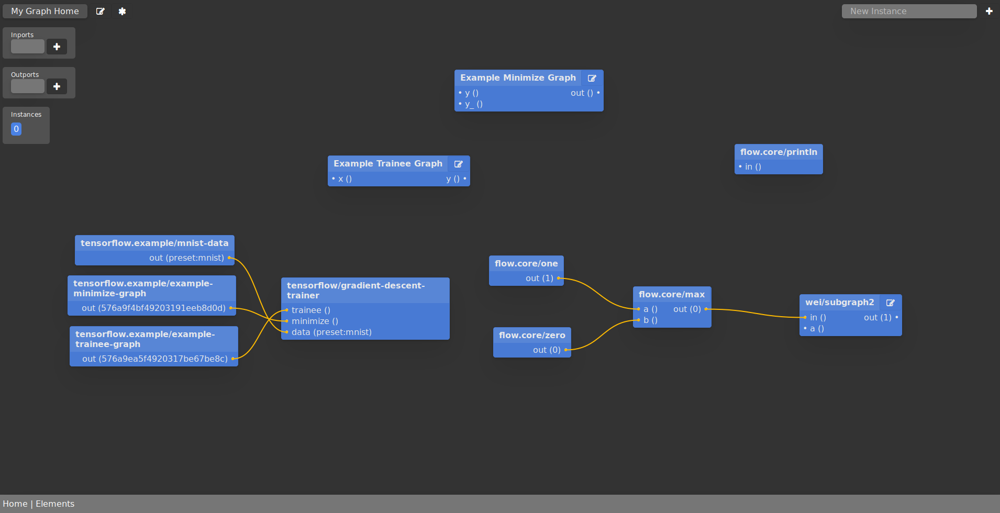
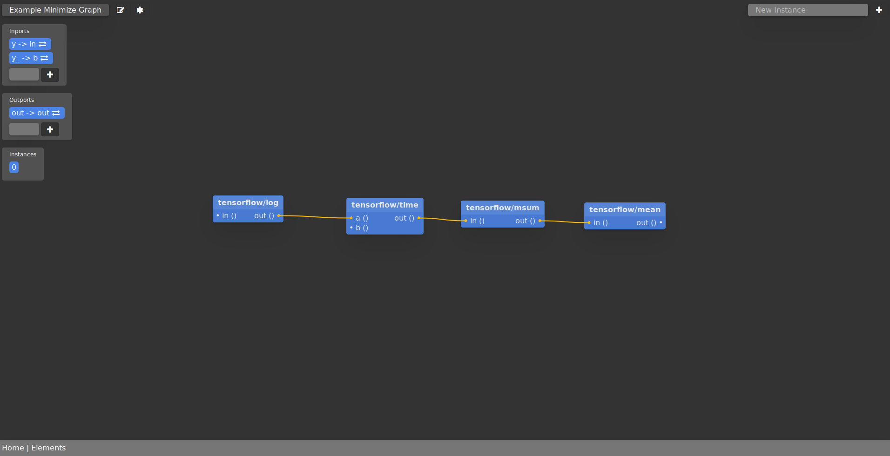
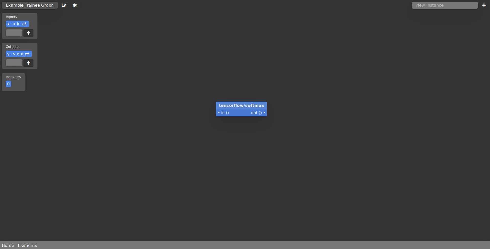
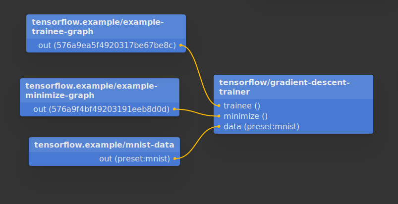

# Flow

*This is a work-in-progress. The program may be buggy. You are warned!*

Flow is a flow-based automation tool that is capable to run simple Machine
Learning programs. In Flow, users mainly work with a drag-and-drop flow-based
"graph" to create Machine Learning components (trainers and minimizers) and
external ones (sending tweets, fetch HTTP endpoints and etc).

Under the hood, Flow uses Tensorflow to do all the Machine Learning tasks.



## Flow-based Graph

Due to different iterations of this program, you may come across terms like
"receipts", "elements" or "graphs", which all mean the same thing -- a
flow-based graph. A flow-based graph consists of "nodes" that have different
"inports" and "outports". Inports are used for receive values and outports are
for sending out values. Those outports can be connected with other inports of
different nodes in the same graph. Those connections transfer values.

A node is associated with a type that does computations to produce values for
outports. The node, when running, is initialized from its type to create
"instances".

A graph itself can also be a type. For this case, a graph can have graph-level
inports and outports.

Unlike other flow-based programming models like [NoFlo](http://noflojs.org/),
Inports and outports of a node are always associated with some values -- in
another word, it is not pulses, but a states. Nodes which send data to external
endpoints (for example, sending tweets) usually requires an inport to be
presented for a certain period of time (for example, five seconds).
Respectively, nodes which receive data from external endpoints usually have
their own refresh rate.

## Machine Learning

Currently the Machine Learning part of Flow is a work-in-progress. It can only
handle really simple ones like
[MNIST handwritten digits](http://yann.lecun.com/exdb/mnist/). An example is
shown below.

## Quickstart

The program consists of several components. They are all required to be running
for the whole program to be functional.

### Mongo Database

Have a Mongo database running in `localhost` of the default port. Refer to
[MongoDB's documentation](https://docs.mongodb.com/manual/installation/) for how
to do this.

### `flow-tensorflow` Server

Start the `flow-tensorflow` server. Refer to
[this repository](https://github.com/sorpaas/flow-tensorflow) for how to do
this.

### Flow Server in Development Mode

Install [Boot](https://github.com/boot-clj/boot). Go to this project's root and
run:

```
boot dev
```

You should see something like this:

```
Starting reload server on ws://localhost:41555
Writing boot_reload.cljs...
Writing boot_cljs_repl.cljs...

Starting file watcher (CTRL-C to quit)...

Compiling {less}... 87 changed files.
Adding :require adzerk.boot-reload to editor.cljs.edn...
nREPL server started on port 45597 on host 127.0.0.1 - nrepl://127.0.0.1:45597
Adding :require adzerk.boot-cljs-repl to editor.cljs.edn...
Compiling ClojureScript...
• js/editor.js
Elapsed time: 29.413 sec
```

Connect to the nREPL using your favourite Clojure tools (Emacs' cider, for
example). If you don't have one installed, simply run this command:

```
boot -C repl -cp 45597
```

In which `45597` is the nREPL port opened as shown above.

In the REPL, run:

```
(in-ns 'dev)
(start)
```

And you should see the server starts running.

### Register a User and Create Your First Graph

Go to `http://127.0.0.1:10555` and you should see Flow's welcome page. Register
a user here (`Sign Up` button on the top-right), and go to
`http://127.0.0.1:10555/graphs/home`. You will see your home graph.

### A MNIST Trainer

Currently to create a trainer the procedure is a little bit tedious, but
nonetheless here are the steps.

#### MNIST Minimizer

Create a new graph by pressing the start ("*") icon on top-left. You should see
a new graph node appears. Press the edit button on that node to enter the graph.

In here, we use the "New Instance" search box on top-right to search for and add
approriate nodes. The result would be something like below:



Create two graph inports `y` and `y_` (using the inports panel on the right),
connect `y` to `tensorflow/log`'s `in` inport, and connect `y_` to
`tensorflow/time`'s `b` inport.

Create one graph outport `out` and connect it to `tensorflow/mean`'s `out`
outport.

Look at the location of your current browser, remember the minimizer's id (the
long string after `127.0.0.1:10555/graphs/`.

You can also press the edit button just right after the graph's name (on
top-left) to give the graph a better name (for example, "Example Minimize
Graph").

#### MNIST Trainee

Go back to your home graph (by pressing browser's go-back button). Create
another new graph (by the star "*" button on top-left). Another new graph node
should appear. Click the edit button on that node.

In here, we only need a softmax node to make it functional. The result would
look something like below:



Create a graph inport `x`, and connect it to `tensorflow/softmax`'s `in`. Create
a graph outport `y`, and connect it to `tensorflow/softmax`'s `out`.

Look at the location of your current browser, remember the trainee's id (the
long string after `127.0.0.1:10555/graphs/`.

#### Modify the Server, Just a Little Bit...

Go to project folder's `src/clj/flow/walker/coordinators/primitives.clj`. Around
line 106, change that to trainee's id as you got above. Around line 112, change
that to minimizer's id as you got above.

Now unfortunately you need to restart the server. Go to the REPL and run:

```
(reset)
```

#### Restart the Server and Create the Final Graph

Go to `127.0.0.1:10555/graph/home` again. Create a graph like this:



Once you connected everything, the server will start to train a MNIST model and
you are done!
